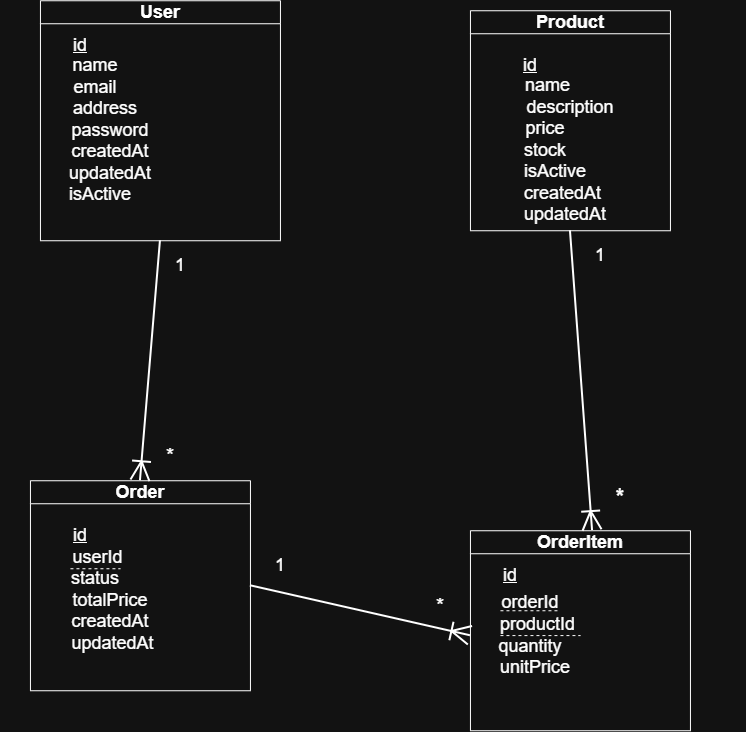

# Cookie Shop Backend

A backend application for an online cookie shop built with **Node.js**, **Express**, **PostgreSQL**, and **Prisma**. This project was created to practice backend engineering concepts, including authentication, database design, clean architecture, and industry-standard development practices.

> **Project Status:** In Progress

---

## Features

* JWT-based authentication (Access & Refresh Tokens)
* User registration and login
* Password hashing with bcrypt
* Protected routes
* Database access using Prisma ORM
* Database migrations with Prisma Migrate
* Product CRUD operations
* Product active/inactive management
* Layered architecture
* Repository pattern
* Centralized error handling
* Custom application errors
* Request correlation IDs
* Request timing middleware
* Structured logging

---

## Tech Stack

| Category       | Technology          |
| :------------- | :------------------ |
| Backend        | Node.js, Express.js |
| Database       | PostgreSQL          |
| ORM            | Prisma              |
| Authentication | JWT, bcrypt         |

---

## Project Structure

```text
├── prisma/
│   ├── migrations/
│   └── schema.prisma
├──src/
│   ├── app/
│   │   ├── auth/
│   │   ├── controllers/
│   │   ├── repositories/
│   │   ├── routes/
│   │   ├── services/
│   │   └── utils/
│   └── common/
│       ├── db/
│       ├── errors/
│       ├── logger/
│       ├── middleware/
│       └── correlation/
└── server.js
```

The project follows a layered architecture where each layer has a single responsibility:

* **Routes** define the API endpoints.
* **Controllers** handle HTTP requests and responses.
* **Services** contain business logic.
* **Repositories** interact with the database.
* **Prisma** manages database access.

---

## Database Design

#### Entity Relationship Diagram


---

## API Endpoints

| Method | Endpoint         | Description                                   |
| :----- | :--------------- | :-------------------------------------------- |
| POST   | `/auth/register` | Register a new user                           |
| POST   | `/auth/login`    | Authenticate a user                           |
| GET    | `/auth/me`       | Retrieve the authenticated user's information |
| POST   | `/auth/refresh`  | Generate a new access token                   |
| GET    | `/auth/logout`   | Logout    (Planned)                           |
| POST   | `/products`      | Create a new product                          |
| GET    | `/products`      | Retrieve all products                         |
| GET    | `/products/active`| Retrieve all active products                 |
| GET    | `/products/:id`  | Retrieve a product by ID                      |
| PATCH  | `/products/:id`  | Update a product                              |
| DELETE | `/products/:id`  | Delete a product                              |

---

## Future Development

Planned features include:

* Order management
* Shopping cart
* Inventory management
* Product search and pagination
* Transactions and concurrency control
* API documentation with Swagger
* Unit and integration testing
* Docker support
* Frontend application
* Deployment

---

## Getting Started

### Clone the repository

```bash
git clone https://github.com/norhanashryy/cookie-shop-backend.git
```

### Install dependencies

```bash
npm install
```

### Configure environment variables

Create a `.env` file and add the following variables:

```env
DATABASE_URL=
ACCESS_TOKEN_SECRET=
REFRESH_TOKEN_SECRET=
```

### Apply database migrations

```bash
npx prisma migrate dev
```

### Generate Prisma Client

```bash
npx prisma generate
```

### Start the server

```bash
npm start
```

---
